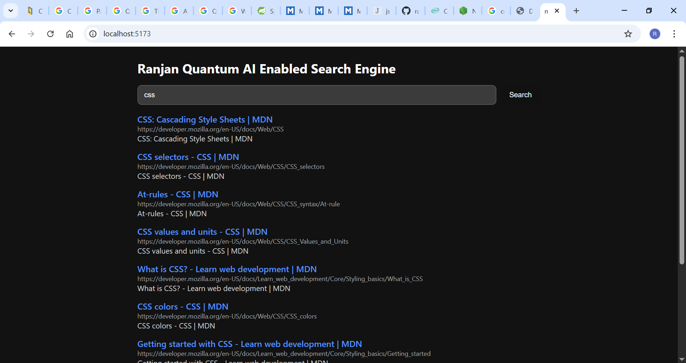
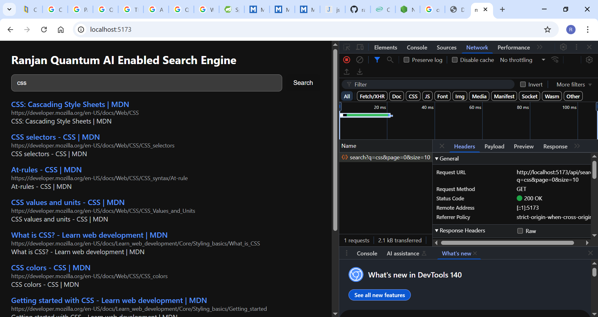
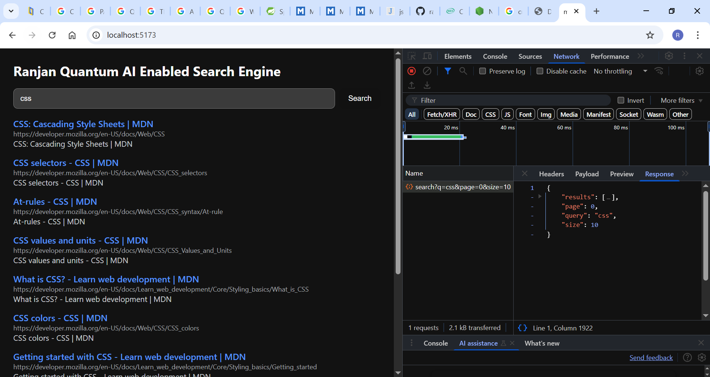
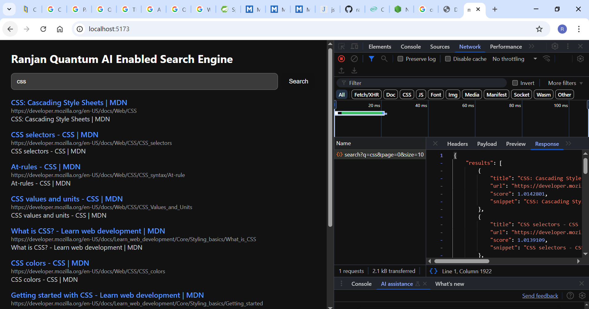
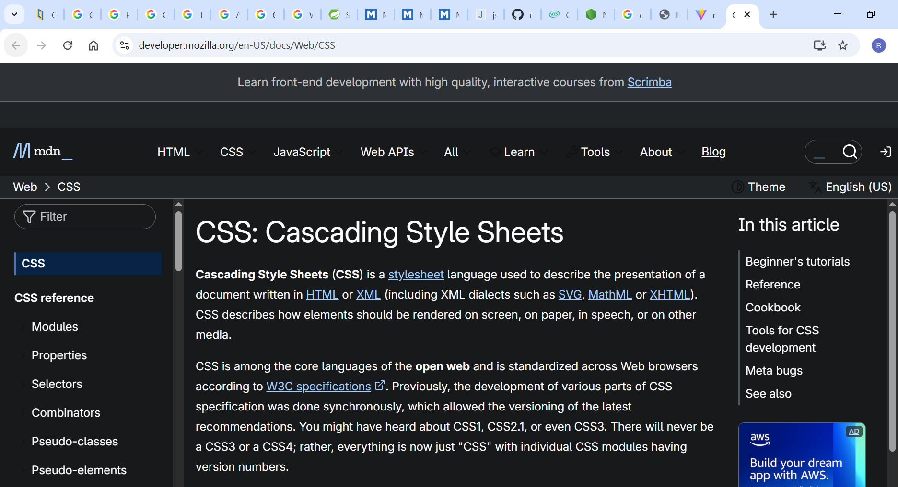

# Quantum AI Enabled Search Engine

This project is the **backend prototype** for a custom search engine.  
It provides REST APIs for crawling web pages, indexing their content using **Apache Lucene**, and retrieving ranked search results.  
The goal is to build a foundation similar to a classical search engine, ready for future integration with **LLM** and **Quantum-AI-based** modules.

## About API Consumption

Frontend (Step-1 prototype) consuming the REST APIs (on localhost:8080):
GET /api/search?q=keyword&page=0&size=10
POST /api/crawl?seed=<url>&maxPages=<n>

## Test Evidences

## You have some query?

If you have some query, feel free to connect with me here -- [Ranjan Kumar Mandal](https://www.linkedin.com/in/ranjan-kumar-m-818367158/)
